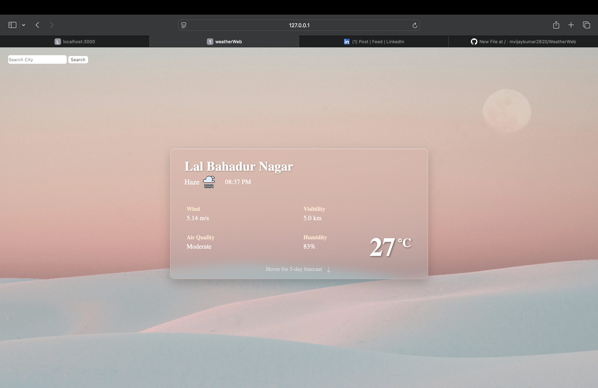
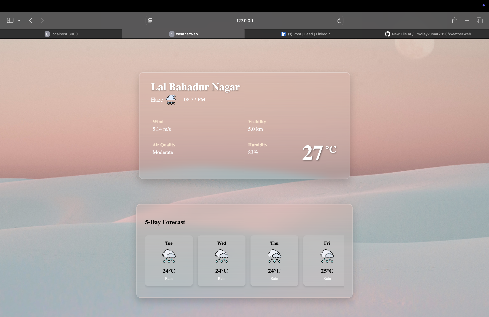

🌤️ Weather App

Welcome to the Weather App repository!<br>
This project is a web application that delivers real-time weather updates for any location.<br>
It’s built with HTML, CSS, and JavaScript and fetches live data from the OpenWeatherMap API.<br>

⸻

✨ Features<br>
	<br>•	Live Weather Data: Get up-to-date weather info for your current location or search for any city worldwide.<br>
	•	5-Day Forecast: Check the 5-day forecast<br>

⸻

🛠 Technologies Used<br>
	<br>•	Frontend: HTML, CSS, JavaScript<br>
	•	API: OpenWeatherMap<br>
	•	Icons: FontAwesome<br>

⸻

📲 Screenshots<br>
<br> main Page



5-Day-Forecast


📚 Additional Information<br>
	<br>•	Get city name or area by longitude/latitude → OpenWeather Geocoding API<br>
	•	Get current location weather → OpenWeather Current API<br>
	•	Get 5-day forecast → OpenWeather Forecast API<br>

⸻

⚙️ Getting Started<br>
<br>
To get a local copy up and running, follow these simple steps.<br>

<br>Prerequisites<br>

<br>✅ A modern web browser<br>
✅ An API key from OpenWeatherMap<br>

<br>Installation<br>

1️⃣ Clone the repository:
```bash
git clone https://github.com/mvijaykumar2820/weatherWeb.git
```
2️⃣ Navigate to the project directory:
```bash
cd weather-app
```
3️⃣ Update your API key inside the JavaScript file:
```bash
const API_KEY = "YOUR_API_KEY";
```
4️⃣ Open index.html in your browser to run the project.

⸻

🖥️ Usage

<br>To use the Weather App:<br>
	•	Enter the name of a city in the search bar and press Enter.<br>
	•	See current weather conditions, temperature, humidity, wind speed, visibility, and more.<br>

⸻

📬 Contact

<br>For any inquiries or collaborations, feel free to reach out:<br>
	•	✉️ Email: mvijaykumar2820@gmail.com<br>
	•	💻 GitHub: https://github.com/mvijaykumar2820<br>
	•	💼 LinkedIn: https://www.linkedin.com/in/m-vijay-kumar2820/<br>

